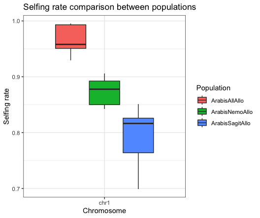

# Selfing Rate (in Time) with eSMC2 and from heterozygosity calculation

This repository provides scripts and example data for calculating and visualizing selfing rates in time with eSMC2 and from heterozygosity data generated using `vcftools`. The selfing rate is computed using the formula from **Nordborg (1999)**, and a boxplot is generated to compare selfing rates across different populations and chromosomes.

## Table of Contents

1. [Introduction](#introduction)
2. [Dependencies](#dependencies)
3. [Input File Format](#input-file-format)
4. [R Script Workflow](#r-script-workflow)
5. [Example Plot](#example-plot)
6. [References](#references)

## Introduction

Selfing rates provide insights into the reproductive systems of populations. I have prepared a `.pdf` file containing the exact workflow for eSMC2. 
As another option we could calculate the selfing rate based on the expected vs. observed heterozygosity obtained from `vcftools`.

The workflow based on heterozygosity includes:
- Extracting heterozygosity data using `vcftools`.
- Calculating selfing rates using the formula:

\[
\text{Selfing Rate} = \frac{2F}{1+F}
\]

- Visualizing the results with a boxplot.

## Dependencies

Ensure the following packages are installed in R:
- `data.table`
- `ggplot2`
- `cowplot`
- `tidyr`

You can install them using:

```R
install.packages(c("data.table", "ggplot2", "cowplot", "tidyr"))
```

## Input File Format

The input file is generated using the following `vcftools` command:

```bash
vcftools --gzvcf <input_vcf> --het --out <output_het>
```

This creates a file with the following columns:
- **Chromosome**: Chromosome identifier.
- **Population**: Population name.
- **INDV**: Individual ID.
- **O(HOM)**: Observed number of homozygous sites.
- **E(HOM)**: Expected number of homozygous sites.
- **N_SITES**: Total number of sites.
- **F**: Inbreeding coefficient.

An example input file (`combined_heterozygosity_introsRem.txt`) is included in this repository.

## R Script Workflow

### Steps Performed

The script:
1. Loads the heterozygosity data.
2. Calculates selfing rates using the formula mentioned above.
3. Creates a boxplot comparing selfing rates across populations.

### Script

The script is provided in `selfing_rate_plot.R`:

```r
# Load required libraries
library(data.table)
library(tidyr)
library(ggplot2)
library(cowplot)

# Load the heterozygosity data
het_all_together <- fread("chrom1")

# Calculate selfing rate
het_all_together$selfing_rate <- (2 * (het_all_together$F)) / (1 + het_all_together$F) 

# Generate the boxplot
p2 <- ggplot(het_all_together, aes(x = Chromosome, y = as.numeric(selfing_rate), fill = Population)) + 
  geom_boxplot() +
  ggtitle("Selfing Rate Comparison Between Populations") +
  xlab("Chromosome") + 
  theme_bw() + 
  ylab("Selfing Rate")

# Display the plot
print(p2)
```

### Running the Script

1. Save the script as `selfing_rate_plot.R`.
2. Place your heterozygosity data file (`chrom1`) in the same directory.
3. Run the script in R:

```R
source("selfing_rate_plot.R")
```

## Example Plot

The script generates a boxplot that compares selfing rates between populations across different chromosomes.

### Plot Description
- **X-axis**: Chromosome.
- **Y-axis**: Selfing rate.
- **Colors**: Represent different populations.



## References

- Nordborg, M. (1999). *"The coalescent with selfing."* Genetics.
